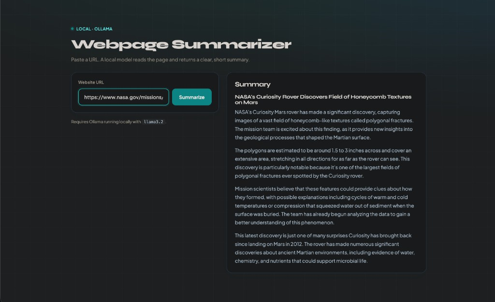

# Webpage Summarizer

Paste a URL, get a short summary — powered by a **local open-source LLM** via [Ollama](https://ollama.com). No OpenAI API key, no cloud costs.

A simple Flask web app: scrape the page → extract readable text → ask `llama3.2` for a markdown summary.



---

## Features

- Local inference with Ollama (OpenAI-compatible API)
- Clean web UI — enter a URL, get a formatted summary
- Works on article pages (e.g. [NASA Curiosity honeycomb textures](https://www.nasa.gov/missions/mars-science-laboratory/curiosity-rover/nasas-curiosity-mars-rover-discovers-field-of-honeycomb-textures/))
- Graceful fallback when a site has a broken SSL certificate chain

---

## Stack

| Piece | Role |
| --- | --- |
| **Flask** | Web UI & form handling |
| **requests** + **BeautifulSoup** | Fetch & clean page HTML |
| **OpenAI Python SDK** | Talk to Ollama’s `/v1` endpoint |
| **Ollama** + `llama3.2` | Local language model |

---

## Prerequisites

- Python 3.10+
- [Ollama](https://ollama.com) installed

```bash
ollama serve          # if the app isn’t already running
ollama pull llama3.2
```

---

## Setup

```bash
cd webpage-summarizer
python3 -m venv .venv
source .venv/bin/activate   # Windows: .venv\Scripts\activate
pip install -r requirements.txt
```

---

## Run

```bash
python app.py
```

Open **[http://127.0.0.1:5000](http://127.0.0.1:5000)**, keep or change the URL, click **Summarize**.

---

## Project structure

```
webpage-summarizer/
├── index.html             # GitHub Pages landing
├── demo.png               # Landing screenshot
├── app.py                 # Flask server & routes
├── summarize.py           # Prompts + Ollama chat call
├── scraper.py             # Fetch page & extract text
├── templates/
│   └── index.html         # Flask web UI
├── assets/
│   └── demo.png           # README screenshot
├── requirements.txt
└── README.md
```

**Live landing:** [kkureli.github.io/llm-webpage-summarizer](https://kkureli.github.io/llm-webpage-summarizer/)  
**Repo:** [github.com/kkureli/llm-webpage-summarizer](https://github.com/kkureli/llm-webpage-summarizer)


---

## How it works

1. **Scrape** — `scraper.py` downloads the page and strips scripts, styles, and other noise  
2. **Prompt** — `summarize.py` builds system + user messages (ignore nav, summarize news if present)  
3. **Generate** — text is sent to the local model through Ollama:

```python
ollama = OpenAI(base_url="http://localhost:11434/v1", api_key="ollama")
```

The `api_key` is only a placeholder for the SDK — nothing is billed to OpenAI.

---

## Notes

- **JS-heavy sites** (many React apps) may return little or no content with this simple scraper  
- **SSL quirks** — some sites send a broken certificate chain; the scraper retries without verify when needed  
- Change the model in `summarize.py` (`MODEL = "llama3.2"`) if you prefer another Ollama model  

---

## License

Homework / personal project — use freely.
